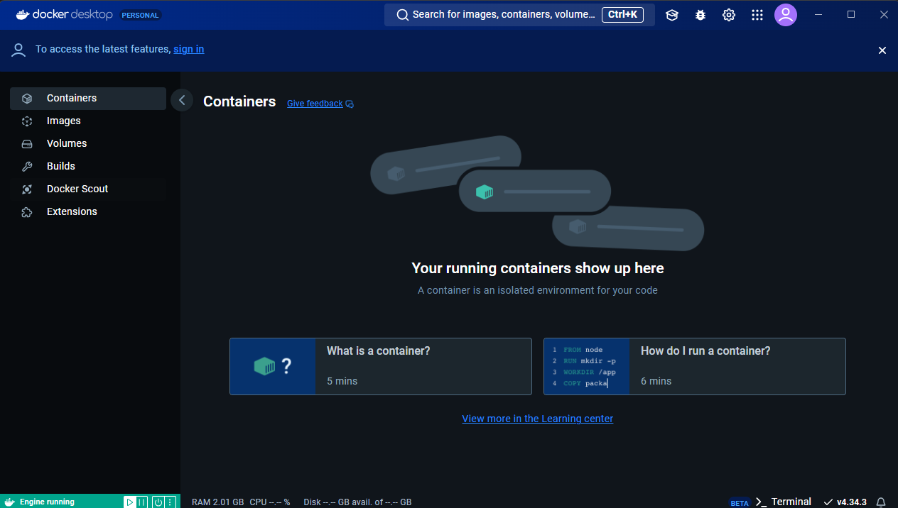
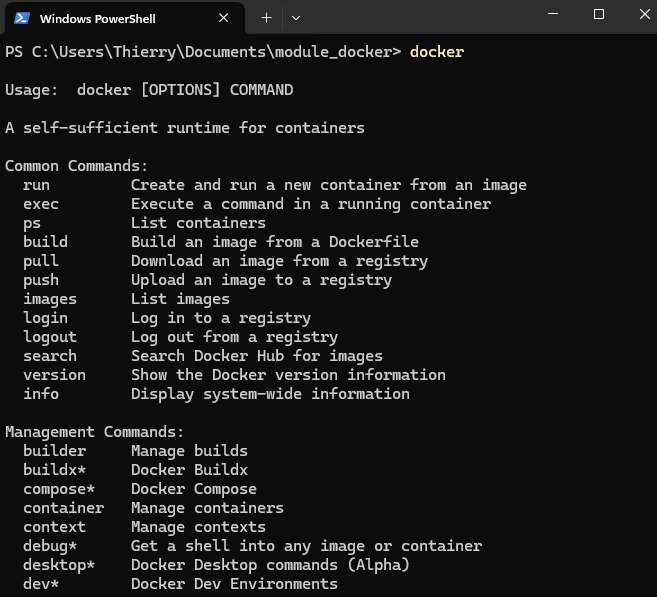
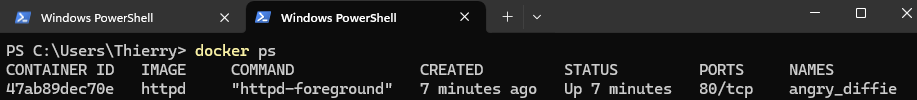
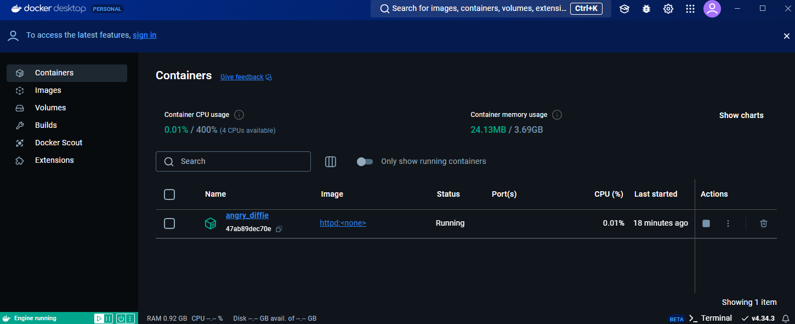
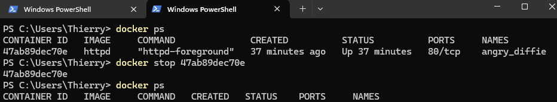

# Exercice 1 - Démarrer un conteneur Docker

## 1. Installation de Docker Desktop

Afin de pouvoir gérer des conteneurs et images Docker sur votre poste de travail, vous utiliserez le logiciel **Docker Desktop**. Pour fonctionner, Docker Desktop s'appuie sur la couche de virtualisation que Windows fournit avec Hyper-V ou plus récemment WSL 2 :

- Rendez-vous sur la [page d'installation de Docker Desktop pour Windows](https://docs.docker.com/desktop/install/windows-install/) et téléchargez l'exécutable : [Docker Desktop Installer.exe](https://desktop.docker.com/win/main/amd64/Docker%20Desktop%20Installer.exe?utm_source=docker&utm_medium=webreferral&utm_campaign=docs-driven-download-win-amd64)

- Lancez l'exécutable pour installer Docker Desktop : cochez la case **Use WSL 2 instead of Hyper-V (recommended)** à l'étape **Configuration**

- Une fois l'installation terminée, cliquez sur **Close and restart** pour redémarrer votre poste.

- Après redémarrage de votre poste, sélectionnez **Use recommended settings (require administrator password)** sur la fenêtre de finalisation d'installation et cliquez sur **Finish**

- Sur la page **Welcome to Docker** qui apparaît, cliquez sur **<u>Skip</u>**

- Faites de même sur les 2 pages du **Welcome Survey**

Vous devriez maintenant avoir la fenêtre Docker Desktop suivante :

## 2. Lancement d'un conteneur

### a. Test de la CLI Docker

Ouvrez une fenêtre de terminal (Powershell ou Bash) et exécutez la commande `docker`. La page d'aide associée à la commande devrait s'afficher :

Cela indique que Docker Desktop a correctement installé la CLI Docker sur votre poste de travail.

### b. Utilisation de la commande docker run

- Depuis votre terminal, exécutez la commande `docker run httpd` pour lancer un conteneur basé sur l'image **httpd**

- Ouvrez une autre fenêtre de terminal et exécutez la commande `docker ps`

La commande **docker ps** affiche des informations relatives aux conteneurs présents sur votre poste de travail (ici, un seul) :

- **CONTAINER ID** - L'identifiant unique du conteneur
- **IMAGE** - *Cf. Suite du cours*
- **COMMAND** - *Cf. Suite du cours*
- **CREATED** - Le temps écoulé depuis la création du conteneur
- **STATUS** - Le statut du conteneur
- **PORTS** - *Cf. Suite du cours*
- **NAMES** - Nom aléatoire donné au conteneur par Docker.

### c. Observations dans Docker Desktop

L'interface graphique de Docker Desktop permet de s'affranchir des commandes Docker pour observer les informations relatives aux conteneurs créés. L'onglet **Containers** permet d'afficher l'ensemble des conteneurs présents sur votre poste de travail :

## 3. Arrêt du conteneur

- Pour arrêter le conteneur, exécutez la commande `docker stop {ID}` en remplaçant **{ID}** par l'ID du conteneur que vous avez créé

- Exécutez la commande `docker ps` et vérifiez que le conteneur que vous venez de supprimer n'est plus listé. 

